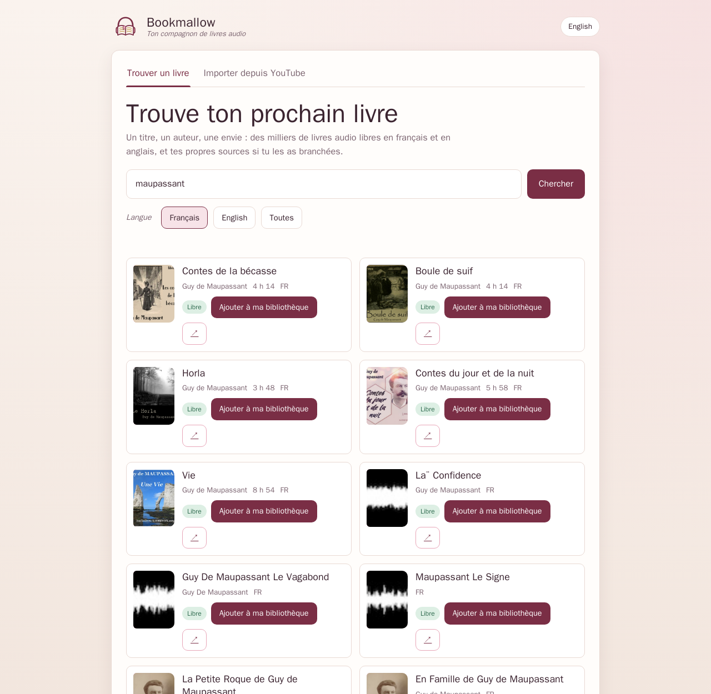

<p align="center"></p>
<h1 align="center">Bookmallow</h1>
<p align="center">Ton compagnon de livres audio, chez toi. · Your audiobook companion, at home.</p>
<p align="center"></p>

---

## 🇫🇷 Français

Bookmallow est un petit serveur de livres audio à héberger soi-même, pensé pour un Raspberry Pi et pour le téléphone de la personne qui écoute. Depuis une page sobre et chaleureuse, on cherche un livre, on l'ajoute à sa bibliothèque, et Bookmallow le prépare en **un seul fichier M4B** avec chapitres et couverture, prêt pour n'importe quelle application de livres audio. Il ne garde que les derniers livres pour ne jamais remplir le disque.

Deux façons de remplir sa bibliothèque :

- **Trouver un livre** : des milliers de livres audio libres de [LibriVox](https://librivox.org) et d'[Internet Archive](https://archive.org), en français et en anglais, et, en option, tes propres indexeurs via Prowlarr et qBittorrent.
- **Importer depuis YouTube** : une lecture, une conférence ou un livre lu sur YouTube devient un MP3 léger, converti en streaming sans jamais poser la vidéo sur le disque, même pour dix-sept heures d'écoute.

### Ce qui le rend agréable

- **Un seul fichier par livre** : M4B chapitré avec couverture pour les livres, MP3 avec chapitres pour YouTube, en 64 kbps mono par défaut (environ 29 Mo par heure).
- **Léger pour le Pi** : une préparation à la fois, progression en direct, annulation, reprise après redémarrage, garde-fou d'espace disque.
- **Rien ne s'accumule** : Bookmallow garde les `MAX_FILES` derniers livres (6 par défaut), le dit clairement et marque le prochain qui disparaîtra.
- **Fait pour être partagé** : mot de passe optionnel, interface français / anglais, aucun script, style ou police externes (seules les couvertures sont chargées depuis LibriVox, Internet Archive ou YouTube).

### Démarrer en trois commandes

```bash
mkdir bookmallow && cd bookmallow
curl -fsSLO https://raw.githubusercontent.com/clemdepernet/bookmallow/main/docker-compose.yml
docker compose up -d
```

Ouvre `http://<ton-serveur>:7843`. Les livres arrivent dans `./data`.

### Trouver un livre

L'onglet d'accueil cherche un titre ou un auteur et affiche chaque résultat comme une petite couverture : source « Libre » ou « Torrent », durée, langue. Un clic sur « Ajouter à ma bibliothèque » suffit ; les chapitres sont lus en streaming par ffmpeg et assemblés en M4B, sans fichier intermédiaire.

- **Sources libres, activées par défaut** : LibriVox et Internet Archive (domaine public, lecteurs bénévoles, catalogue anglais très fourni, classiques français).
- **Tes indexeurs, en option** : si tu utilises déjà Prowlarr et qBittorrent, renseigne `PROWLARR_URL`, `PROWLARR_API_KEY`, `QBT_URL`, `QBT_USER`, `QBT_PASSWORD`, monte le dossier de téléchargement de qBittorrent en lecture seule sur `/incoming` et place Bookmallow sur le même réseau Docker. Une fois le livre assemblé, le torrent et ses fichiers sont supprimés de qBittorrent. Ce que tu télécharges par cette voie relève de ta responsabilité.
- Un lien partageable ouvre directement une recherche : `http://<ton-serveur>:7843/?tab=store&q=maupassant&lang=fr`.

| Variable | Défaut | Rôle |
|---|---|---|
| `STORE_ENABLED` | `1` | `0` masque l'onglet |
| `STORE_LIBRIVOX` / `STORE_ARCHIVE` | `1` | Sources libres |
| `PROWLARR_URL` / `PROWLARR_API_KEY` | vide | Prowlarr (ex. `http://prowlarr:9696`) |
| `QBT_URL` / `QBT_USER` / `QBT_PASSWORD` | vide | qBittorrent WebUI (ex. `http://qbittorrent:8080`) |
| `QBT_CATEGORY` | `bookmallow` | Catégorie qBittorrent utilisée (créée si absente) |
| `QBT_PATH_MAP` | `/downloads:/incoming` | Chemin vu par qBittorrent : chemin vu par Bookmallow |
| `TORRENT_STALL_HOURS` | `12` | Abandon d'un torrent sans progression |
| `BOOK_BITRATE` | `64k` | Débit AAC du M4B |
| `STORE_TIMEOUT_S` | `20` | Délai des appels aux sources |

Exemple compose avec le volet torrent :

```yaml
services:
  bookmallow:
    image: ghcr.io/clemdepernet/bookmallow:latest
    ports: ["7843:5000"]
    volumes:
      - ./data:/data
      - /chemin/vers/downloads/qbittorrent:/incoming:ro
    environment:
      - PROWLARR_URL=http://prowlarr:9696
      - PROWLARR_API_KEY=${PROWLARR_API_KEY}
      - QBT_URL=http://qbittorrent:8080
      - QBT_USER=${QBT_USER}
      - QBT_PASSWORD=${QBT_PASSWORD}
    networks: [medianet]
networks:
  medianet:
    external: true
    name: media-stack_medianet
```

### Importer depuis YouTube


Colle un lien : `yt-dlp` envoie l'audio directement à `ffmpeg`, qui écrit le MP3 final. Une vidéo de dix heures pèse environ 290 Mo, au lieu de 1,5 Go de pic avec un téléchargement classique. Les playlists proposent de choisir les vidéos à importer.

`yt-dlp` doit suivre YouTube de près : l'image est reconstruite **chaque lundi** avec la dernière version, un `docker compose pull && docker compose up -d` suffit. En dépannage rapide, `YTDLP_AUTO_UPDATE=1` met yt-dlp à jour au démarrage. Une erreur « vérification anti-robot » signifie que YouTube challenge l'adresse IP du serveur : mettre yt-dlp à jour ou patienter quelques heures résout généralement le problème.

### Configuration générale

| Variable | Défaut | Rôle |
|---|---|---|
| `MAX_FILES` | `6` | Nombre de livres conservés ; les plus anciens sont supprimés |
| `DEFAULT_QUALITY` | `64` | `64` (voix, mono, ~29 Mo/h), `128` (~58 Mo/h) ou `192` (~86 Mo/h) pour les imports YouTube |
| `APP_PASSWORD` | vide | Mot de passe partagé ; vide = pas de connexion |
| `DEFAULT_LANG` | `fr` | `fr` ou `en` (chaque personne peut basculer) |
| `MIN_FREE_MB` | `500` | Espace disque à toujours garder libre |
| `MAX_DURATION_HOURS` | `0` | `0` = aucune limite de durée |
| `PUID` / `PGID` | `1000` | Propriétaire des fichiers dans `./data` |
| `TZ` | `UTC` | Fuseau horaire des logs. L'exemple docker-compose.yml met Europe/Paris : adapte-le |
| `YTDLP_AUTO_UPDATE` | `0` | `1` = met yt-dlp à jour à chaque démarrage |
| `FORCE_HTTPS` | `0` | `1` derrière un reverse proxy HTTPS (cookie `Secure`) |
| `SECRET_KEY` | générée | Clé des sessions, persistée dans `/data/.secret` |
| `LOG_LEVEL` | `INFO` | Niveau de log de gunicorn/Flask (`DEBUG`, `INFO`, `WARNING`…) |
| `DATA_DIR` | `/data` | Dossier des livres, de `state.json` et de `.secret` |

### Partager avec ses proches

Mets un `APP_PASSWORD`, puis expose le port 7843 avec ton reverse proxy habituel (Nginx Proxy Manager, Caddy, Traefik) ou un tunnel Cloudflare. Bookmallow ne prépare qu'un livre à la fois : même partagé, il reste sage avec ton Pi. Attention : il n'y a **aucune limitation de tentatives** sur `/login` ; si tu exposes l'app sur Internet, mets une protection devant (Cloudflare Access, une liste d'accès dans Nginx Proxy Manager, ou fail2ban) et active `FORCE_HTTPS=1` derrière un reverse proxy TLS.

### Construire soi-même

```bash
git clone https://github.com/clemdepernet/bookmallow.git && cd bookmallow
docker build --target test .        # lance la suite de tests dans l'image
docker compose up -d --build        # après avoir décommenté `build: .`
```

---

## 🇬🇧 English

Bookmallow is a small self-hosted audiobook server, designed for a Raspberry Pi and for the phone of whoever is listening. From one calm, warm page you look for a book, add it to your library, and Bookmallow prepares it as **a single M4B file** with chapters and cover art, ready for any audiobook app. It only keeps the latest books, so the disk never fills up.

Two ways to fill the library:

- **Find a book**: thousands of free audiobooks from [LibriVox](https://librivox.org) and [Internet Archive](https://archive.org), in French and English, plus your own indexers through Prowlarr and qBittorrent if you want them.
- **Import from YouTube**: a reading, a lecture or a narrated book on YouTube becomes a light MP3, converted while streaming without ever writing the video to disk, even for seventeen hours of listening.

### What makes it pleasant

- **One file per book**: a chaptered M4B with cover for books, an MP3 with chapters for YouTube imports, 64 kbps mono by default (about 29 MB per hour).
- **Gentle on the Pi**: one preparation at a time, live progress, cancel, recovery after a restart, disk-space guard.
- **Nothing piles up**: Bookmallow keeps the `MAX_FILES` most recent books (6 by default), says so plainly and marks the next one to go.
- **Made to share**: optional password, French / English interface, no external scripts, styles or fonts (only cover images are loaded from LibriVox, Internet Archive or YouTube).

### Quick start

```bash
mkdir bookmallow && cd bookmallow
curl -fsSLO https://raw.githubusercontent.com/clemdepernet/bookmallow/main/docker-compose.yml
docker compose up -d
```

Open `http://<your-server>:7843`. Books land in `./data`.

### Find a book

The home tab searches a title or an author and shows each result as a small book cover: "Free" or "Torrent" source, duration, language. One click on "Add to my library" is enough; chapters are streamed straight into ffmpeg and assembled into an M4B, with no intermediate file.

- **Free sources, on by default**: LibriVox and Internet Archive (public domain, volunteer readers, huge English catalogue, French classics).
- **Your indexers, optional**: if you already run Prowlarr and qBittorrent, set `PROWLARR_URL`, `PROWLARR_API_KEY`, `QBT_URL`, `QBT_USER`, `QBT_PASSWORD`, mount qBittorrent's download folder read-only at `/incoming` and put Bookmallow on the same Docker network. Once a book is assembled, the torrent and its files are removed from qBittorrent. What you download this way is your responsibility.
- A shareable link opens a search directly: `http://<your-server>:7843/?tab=store&q=austen&lang=en`.

| Variable | Default | Purpose |
|---|---|---|
| `STORE_ENABLED` | `1` | `0` hides the tab |
| `STORE_LIBRIVOX` / `STORE_ARCHIVE` | `1` | Free sources |
| `PROWLARR_URL` / `PROWLARR_API_KEY` | empty | Prowlarr (e.g. `http://prowlarr:9696`) |
| `QBT_URL` / `QBT_USER` / `QBT_PASSWORD` | empty | qBittorrent WebUI (e.g. `http://qbittorrent:8080`) |
| `QBT_CATEGORY` | `bookmallow` | qBittorrent category (created if missing) |
| `QBT_PATH_MAP` | `/downloads:/incoming` | Path as seen by qBittorrent : path as seen by Bookmallow |
| `TORRENT_STALL_HOURS` | `12` | Give up on a torrent without progress |
| `BOOK_BITRATE` | `64k` | AAC bitrate of the M4B |
| `STORE_TIMEOUT_S` | `20` | Timeout for source calls |

Compose example with the torrent option:

```yaml
services:
  bookmallow:
    image: ghcr.io/clemdepernet/bookmallow:latest
    ports: ["7843:5000"]
    volumes:
      - ./data:/data
      - /path/to/qbittorrent/downloads:/incoming:ro
    environment:
      - PROWLARR_URL=http://prowlarr:9696
      - PROWLARR_API_KEY=${PROWLARR_API_KEY}
      - QBT_URL=http://qbittorrent:8080
      - QBT_USER=${QBT_USER}
      - QBT_PASSWORD=${QBT_PASSWORD}
    networks: [medianet]
networks:
  medianet:
    external: true
    name: media-stack_medianet
```

### Import from YouTube

Paste a link: `yt-dlp` pipes the audio straight into `ffmpeg`, which writes the final MP3. A ten-hour video weighs about 290 MB instead of a 1.5 GB peak with a classic download-then-convert. Playlists let you pick the videos to import.

`yt-dlp` has to keep up with YouTube: the image is rebuilt **every Monday** with the latest release, so `docker compose pull && docker compose up -d` is all you need. As a quick fix, `YTDLP_AUTO_UPDATE=1` upgrades yt-dlp when the container starts. A "bot check" error means YouTube is challenging the server's IP address: updating yt-dlp or waiting a while usually resolves it.

### General configuration

| Variable | Default | Purpose |
|---|---|---|
| `MAX_FILES` | `6` | Books kept; older ones are deleted |
| `DEFAULT_QUALITY` | `64` | `64` (voice, mono, ~29 MB/h), `128` (~58 MB/h) or `192` (~86 MB/h) for YouTube imports |
| `APP_PASSWORD` | empty | Shared password; empty = no login |
| `DEFAULT_LANG` | `fr` | `fr` or `en` (each visitor can switch) |
| `MIN_FREE_MB` | `500` | Disk space to always keep free |
| `MAX_DURATION_HOURS` | `0` | `0` = no duration limit |
| `PUID` / `PGID` | `1000` | Owner of the files in `./data` |
| `TZ` | `UTC` | Log timezone. The example docker-compose.yml sets Europe/Paris: adjust it |
| `YTDLP_AUTO_UPDATE` | `0` | `1` = upgrade yt-dlp at every start |
| `FORCE_HTTPS` | `0` | `1` behind an HTTPS reverse proxy (`Secure` cookie) |
| `SECRET_KEY` | generated | Session key, persisted in `/data/.secret` |
| `LOG_LEVEL` | `INFO` | gunicorn/Flask log level (`DEBUG`, `INFO`, `WARNING`…) |
| `DATA_DIR` | `/data` | Folder for the books, `state.json` and `.secret` |

### Sharing with the people you love

Set `APP_PASSWORD`, then expose port 7843 through your usual reverse proxy (Nginx Proxy Manager, Caddy, Traefik) or a Cloudflare tunnel. Bookmallow prepares one book at a time, so it stays gentle with your Pi even when shared. Note that there is **no rate limiting** on `/login`; if you expose the app to the internet, put a guard in front of it (Cloudflare Access, an Nginx Proxy Manager access list, or fail2ban) and set `FORCE_HTTPS=1` behind a TLS-terminating reverse proxy.

### Build it yourself

```bash
git clone https://github.com/clemdepernet/bookmallow.git && cd bookmallow
docker build --target test .        # runs the test suite inside the image
docker compose up -d --build        # after uncommenting `build: .`
```

---

## Credits

Bookmallow started as a fork of [TheFatPanda-Dev/youtube-to-mp3-docker](https://github.com/TheFatPanda-Dev/youtube-to-mp3-docker) (MIT). Thank you! The backend was rewritten around streaming conversion, a queue and retention, then grew into an audiobook companion.

Powered by [yt-dlp](https://github.com/yt-dlp/yt-dlp), [ffmpeg](https://ffmpeg.org), [Flask](https://flask.palletsprojects.com) and [deno](https://deno.com). Free audiobooks by the volunteers of [LibriVox](https://librivox.org) and the [Internet Archive](https://archive.org). MIT license.
